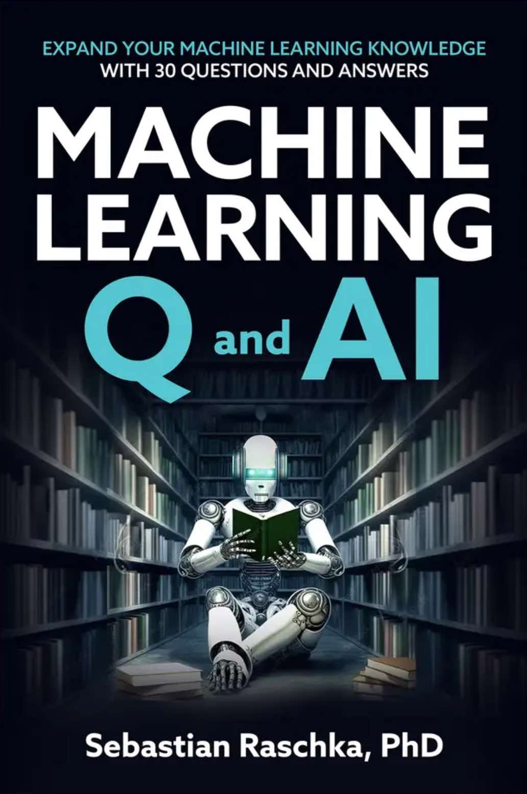

# *Machine Learning Q and AI* Book

The Supplementary Materials for the [Machine Learning Q and AI](https://leanpub.com/machine-learning-q-and-ai) book by [Sebastian Raschka](http://sebastianraschka.com).

Please use the [Discussions](https://github.com/rasbt/ml-q-and-ai/discussions) for any questions about the book!

