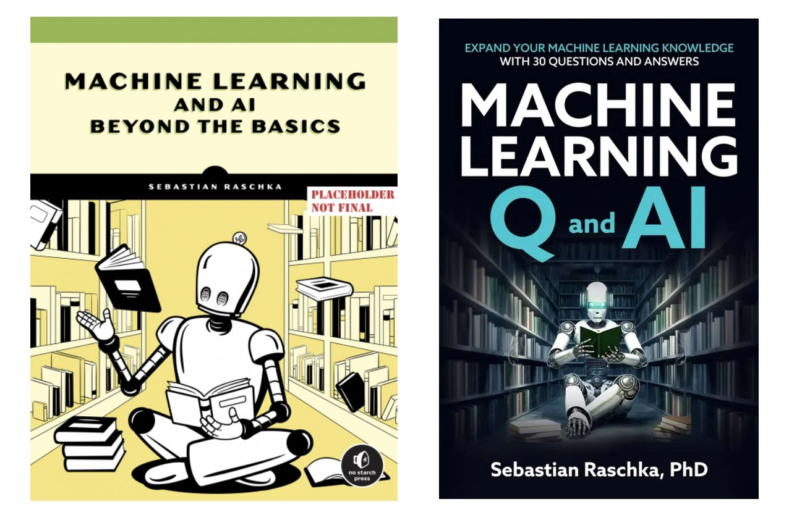

# *Machine Learning Q and AI Beyond the Basics* Book

The Supplementary Materials for the [Machine Learning Q and AI](https://nostarch.com/machine-learning-q-and-ai) book by [Sebastian Raschka](http://sebastianraschka.com).

Please use the [Discussions](https://github.com/rasbt/ml-q-and-ai/discussions) for any questions about the book!

 

#### About the Book

If you’ve locked down the basics of machine learning and AI and want a fun way to address lingering knowledge gaps, this book is for you. This rapid-fire series of short chapters addresses 30 essential questions in the field, helping you stay current on the latest technologies you can implement in your own work.

Each chapter of *Machine Learning Q and AI* asks and answers a central question, with diagrams to explain new concepts and ample references for further reading

- Multi-GPU training paradigms
- Finetuning transformers
- Differences between encoder- and decoder-style LLMs
- Concepts behind vision transformers
- Confidence intervals for ML
- And many more!

This book is a fully edited and revised version of <a href="https://leanpub.com/machine-learning-q-and-ai">Machine Learning Q and AI</a>, which was available on Leanpub.

 

#### Reviews

> “One could hardly ask for a better guide than Sebastian, who is, without exaggeration, the best machine learning educator currently in the field. On each page, Sebastian not only imparts his extensive knowledge but also shares the passion and curiosity that mark true expertise.” 
**-- Chris Albon, Director of Machine Learning, The Wikimedia Foundation**

 

#### Links

- [Preorder directly from No Starch press](https://nostarch.com/machine-learning-q-and-ai)
- [Preorder directly from Amazon](https://www.amazon.com/Machine-Learning-AI-Essential-Questions/dp/1718503768)
- [Supplementary Materias and Discussions](https://github.com/rasbt/MachineLearning-QandAI-book)

 
 

## Table of Contents

| Title | URL Link | Supplementary Code |
|---------|-------|----------|
| 1 | Embeddings, Representations, and Latent Space | |
| 2 | Self-Supervised Learning | |
| 3 | Few-Shot Learning | |
| 4 | The Lottery Ticket Hypothesis | |
| 5 | Reducing Overfitting with Data | |
| 6 | Reducing Overfitting with Model Modifications | |
| 7 | Multi-GPU Training Paradigms | |
| 8 | The Keys to the Success of Transformers | |
| 9 | Generative AI Models | |
| 10 | Sources of Randomness | [data-sampling.ipynb](https://github.com/rasbt/MachineLearning-QandAI-book/blob/main/supplementary/q10-random-sources/data-sampling.ipynb)   [dropout.ipynb](https://github.com/rasbt/MachineLearning-QandAI-book/blob/main/supplementary/q10-random-sources/dropout.ipynb)    [random-weights.ipynb](https://github.com/rasbt/MachineLearning-QandAI-book/blob/main/supplementary/q10-random-sources/random-weights.ipynb)|
|| PART II: COMPUTER VISION | |
| 11 | Calculating the Number of Parameters | [conv-size.ipynb](https://github.com/rasbt/MachineLearning-QandAI-book/blob/main/supplementary/q11-conv-size/q11-conv-size.ipynb)|
| 12 | The Equivalence of Fully Connected and Convolutional Layers | [fc-cnn-equivalence.ipynb](https://github.com/rasbt/MachineLearning-QandAI-book/blob/main/supplementary/q12-fc-cnn-equivalence/q12-fc-cnn-equivalence.ipynb)|
| 13 | Large Training Sets for Vision Transformers | |
|| PART III: NATURAL LANGUAGE PROCESSING | |
| 14 | The Distributional Hypothesis | |
| 15 | Data Augmentation for Text | [backtranslation.ipynb](https://github.com/rasbt/MachineLearning-QandAI-book/blob/main/supplementary/q15-text-augment/backtranslation.ipynb)   [noise-injection.ipynb](https://github.com/rasbt/MachineLearning-QandAI-book/blob/main/supplementary/q15-text-augment/noise-injection.ipynb)   [sentence-order-shuffling.ipynb](https://github.com/rasbt/MachineLearning-QandAI-book/blob/main/supplementary/q15-text-augment/sentence-order-shuffling.ipynb)   [synonym-replacement.ipynb](https://github.com/rasbt/MachineLearning-QandAI-book/blob/main/supplementary/q15-text-augment/synonym-replacement.ipynb)   [synthetic-data.ipynb](https://github.com/rasbt/MachineLearning-QandAI-book/blob/main/supplementary/q15-text-augment/synthetic-data.ipynb)   [word-deletion.ipynb](https://github.com/rasbt/MachineLearning-QandAI-book/blob/main/supplementary/q15-text-augment/word-deletion.ipynb)   [word-position-swapping.ipynb](https://github.com/rasbt/MachineLearning-QandAI-book/blob/main/supplementary/q15-text-augment/word-position-swapping.ipynb)|
| 16 | “Self”-Attention | |
| 17 | Encoder- And Decoder-Style Transformers | |
| 18 | Using and Finetuning Pretrained Transformers | |
| 19 | Evaluating Generative Large Language Models | [BERTScore.ipynb](https://github.com/rasbt/MachineLearning-QandAI-book/blob/main/supplementary/q19-evaluation-llms/BERTScore.ipynb)   [bleu.ipynb](https://github.com/rasbt/MachineLearning-QandAI-book/blob/main/supplementary/q19-evaluation-llms/bleu.ipynb)   [perplexity.ipynb](https://github.com/rasbt/MachineLearning-QandAI-book/blob/main/supplementary/q19-evaluation-llms/perplexity.ipynb)   [rouge.ipynb](https://github.com/rasbt/MachineLearning-QandAI-book/blob/main/supplementary/q19-evaluation-llms/rouge.ipynb) |
|| PART IV: PRODUCTION AND DEPLOYMENT | |
| 20 | Stateless And Stateful Training | |
| 21 | Data-Centric AI | |
| 22 | Speeding Up Inference | |
| 23 | Data Distribution Shifts | |
| | PART V: PREDICTIVE PERFORMANCE AND MODEL EVALUATION | |
| 24 | Poisson and Ordinal Regression | |
| 25 | Confidence Intervals | [four-methods.ipynb](https://github.com/rasbt/MachineLearning-QandAI-book/blob/main/supplementary/q25_confidence-intervals/1_four-methods.ipynb)   [four-methods-vs-true-value.ipynb](https://github.com/rasbt/MachineLearning-QandAI-book/blob/main/supplementary/q25_confidence-intervals/2_four-methods-vs-true-value.ipynb)|
| 26 | Confidence Intervals Versus Conformal Predictions | [conformal_prediction.ipynb](https://github.com/rasbt/MachineLearning-QandAI-book/blob/main/supplementary/q26_conformal-prediction/conformal_prediction.ipynb) |
| 27 | Proper Metrics | |
| 28 | The K in K-Fold Cross-Validation | |
| 29 | Training and Test Set Discordance | |
| 30 | Limited Labeled Data | |

